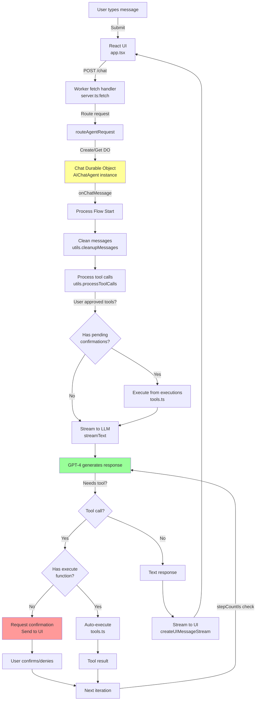

# 📊 Agents-Starter Project Analysis

A comprehensive breakdown of the Cloudflare **agents-starter** project - an AI chat agent with tool execution, human-in-the-loop confirmation, and task scheduling capabilities.

---

## 🏗️ **Architecture Overview**

This is a **full-stack AI chat application** that runs on **Cloudflare Workers** using the **Agents Framework**. The architecture follows:

**User types** → **React UI** → **Agent Router** → **AI Chat Agent** → **LLM (OpenAI)** → **Tools Execute** → **Stream Response** → **UI Updates**

**Key Difference from talk2ai**: This is a text-based chat agent with **tool calling** and **human-in-the-loop confirmations**, whereas talk2ai is voice-based.

---

## 🤖 **AI Models Used**

The project uses **OpenAI's GPT-4** by default:

1. **Language Model**: `gpt-4o-2024-11-20`
   - Located in: [`src/server.ts:21`](file:///c:/Users/AJay/Desktop/aiboard/agents-starter/src/server.ts#L21)
   - Handles conversation and tool selection
   - Can be swapped for Workers AI or Anthropic models

---

## 📁 **File Structure & Key Components**

### **Backend Files (TypeScript)**

#### 1. **`src/server.ts`** - Main Agent Logic (133 lines)

**Purpose**: Core agent implementation and request routing

**Key Components**:
- **`Chat` class** (extends `AIChatAgent<Env>`)
  - Main agent that handles chat messages
  - Inherits from `agents` framework base class
  - Manages state via Durable Objects automatically

**Key Methods**:

##### `onChatMessage(onFinish, options)` - Lines 35-87
The heart of the agent flow:

```typescript
async onChatMessage(onFinish, options) {
  // 1. Collect all tools (including MCP tools)
  const allTools = { ...tools, ...this.mcp.getAITools() };
  
  // 2. Create UI message stream
  const stream = createUIMessageStream({
    execute: async ({ writer }) => {
      // 3. Clean incomplete tool calls
      const cleanedMessages = cleanupMessages(this.messages);
      
      // 4. Process pending tool calls (human confirmations)
      const processedMessages = await processToolCalls({
        messages: cleanedMessages,
        dataStream: writer,
        tools: allTools,
        executions
      });
      
      // 5. Call LLM with streaming
      const result = streamText({
        system: "You are a helpful assistant...",
        messages: convertToModelMessages(processedMessages),
        model,
        tools: allTools,
        onFinish,
        stopWhen: stepCountIs(10) // Max 10 tool call iterations
      });
      
      // 6. Merge LLM stream with UI stream
      writer.merge(result.toUIMessageStream());
    }
  });
  
  return createUIMessageStreamResponse({ stream });
}
```

**Flow Explained**:
1. **Gather tools**: Combines static tools + MCP tools
2. **Clean messages**: Remove incomplete/corrupted tool calls
3. **Process confirmations**: Execute tools user approved
4. **Stream LLM**: Call GPT-4 with conversation + tools
5. **Return stream**: React UI receives updates in real-time

##### `executeTask(description, task)` - Lines 88-105
Handles scheduled task execution:
- Called when a scheduled task triggers
- Adds task description as a user message
- Agent processes it like a new conversation turn

##### `fetch()` handler - Lines 111-132
Worker entry point:
- Checks for OpenAI API key
- Routes agent requests via `routeAgentRequest()`
- Returns 404 for non-agent endpoints

**Imports**:
- `agents`: Framework for agent routing and scheduling
- `ai`: Vercel AI SDK for streaming
- `@ai-sdk/openai`: OpenAI provider
- `./utils`: Message processing utilities
- `./tools`: Tool definitions and executions

---

#### 2. **`src/tools.ts`** - Tool Definitions (134 lines)

**Purpose**: Defines what the agent can do

**Tool Types**:

##### **Type 1: Auto-Execute Tools** (with `execute` function)
These run immediately without user approval:

```typescript
const getLocalTime = tool({
  description: "get the local time for a specified location",
  inputSchema: z.object({ location: z.string() }),
  execute: async ({ location }) => {
    return "10am"; // Runs immediately
  }
});
```

**Examples**:
- `getLocalTime`: Get time for a location
- `scheduleTask`: Schedule future tasks
- `getScheduledTasks`: List scheduled tasks
- `cancelScheduledTask`: Cancel a task

##### **Type 2: Confirmation-Required Tools** (no `execute` function)
These need human approval:

```typescript
const getWeatherInformation = tool({
  description: "show the weather in a given city to the user",
  inputSchema: z.object({ city: z.string() })
  // No execute = requires confirmation
});
```

**Execution Handling**:
When user approves, runs code from `executions` object:

```typescript
export const executions = {
  getWeatherInformation: async ({ city }: { city: string }) => {
    return `The weather in ${city} is sunny`;
  }
};
```

##### **Task Scheduling Tool** - Lines 36-65
The `scheduleTask` tool supports 3 scheduling modes:

1. **Scheduled** (specific date): `"Schedule meeting for 2025-12-01 at 3pm"`
2. **Delayed** (seconds from now): `"Remind me in 30 minutes"` (1800 seconds)
3. **Cron** (recurring): `"Check emails every hour"` (`0 * * * *`)

**How it works**:
```typescript
const scheduleTask = tool({
  inputSchema: scheduleSchema, // Validates schedule format
  execute: async ({ when, description }) => {
    const { agent } = getCurrentAgent<Chat>(); // Get current agent instance
    
    const input = 
      when.type === "scheduled" ? when.date :
      when.type === "delayed" ? when.delayInSeconds :
      when.type === "cron" ? when.cron : null;
    
    agent.schedule(input, "executeTask", description);
    return `Task scheduled for ${when.type}: ${input}`;
  }
});
```

**Exports**:
- `tools`: Object containing all tool definitions
- `executions`: Handlers for confirmation-required tools

---

#### 3. **`src/utils.ts`** - Message Processing (123 lines)

**Purpose**: Handles human-in-the-loop tool confirmations

**Key Functions**:

##### `processToolCalls()` - Lines 22-100
Processes tool calls that need user approval:

**Flow**:
1. Loops through all messages
2. Finds tool UI parts with `state: "output-available"`
3. Checks if tool is in `executions` object
4. If user said "Yes":
   - Executes the tool function from `executions`
   - Gets the result
5. If user said "No":
   - Returns error: "User denied access"
6. Writes result to data stream (updates UI)
7. Returns updated messages with results

**Critical Code**:
```typescript
if (part.output === APPROVAL.YES) {
  // User approved
  const toolInstance = executions[toolName];
  result = await toolInstance(part.input, {...});
} else if (part.output === APPROVAL.NO) {
  result = "Error: User denied access";
}

// Send result to UI
dataStream.write({
  type: "tool-output-available",
  toolCallId: part.toolCallId,
  output: result
});
```

##### `cleanupMessages()` - Lines 106-122
Removes corrupted/incomplete tool calls:

**Removes messages with**:
- `state: "input-streaming"` (still being called)
- `state: "input-available"` but no output (stuck)

**Why needed**: Prevents API errors from interrupted tool executions

---

#### 4. **`src/shared.ts`** - Shared Constants (6 lines)

**Purpose**: Constants shared between frontend and backend

```typescript
export const APPROVAL = {
  YES: "Yes, confirmed.",
  NO: "No, denied."
} as const;
```

**Usage**: Ensures frontend/backend use same approval strings

---

### **Frontend Files (TypeScript/React)**

#### 5. **`src/app.tsx`** - Main Chat UI (489 lines)

**Purpose**: React component for the chat interface

**Key Features**:

##### Chat Component (Lines 35-414)
Main React component with:

**State Management**:
```typescript
const {
  messages,        // Chat history
  input,           // Current input text
  agentError,      // Agent errors
  agentIsLoading,  // Loading state
  handleAgentSubmit, // Submit handler
  appendMessage,   // Add message
  ...
} = useAgent({
  agentId: "Chat", // References Chat class from server.ts
  initialMessages: []
});
```

**Tool Confirmation Dialog**:
- Detects tools requiring confirmation
- Shows modal with tool name and parameters
- User clicks "Confirm" or "Cancel"
- Sends approval message to backend

**Message Rendering**:
- User messages: Blue bubbles on right
- AI messages: Gray bubbles on left
- Tool calls: Shows tool icon + status
- Streaming: Real-time text updates

**UI Elements**:
- Theme toggle (dark/light mode)
- Message list with auto-scroll
- Input field with submit button
- Loading indicators
- Error displays

---

#### 6. **`src/components/memoized-markdown.tsx`** - Markdown Renderer (36 lines)

**Purpose**: Efficient markdown rendering for AI responses

**Key Features**:
- Parses markdown into blocks using `marked.lexer()`
- Memoizes each block separately
- Only re-renders changed blocks (performance optimization)
- Supports GitHub Flavored Markdown (tables, strikethrough, etc.)

**Why Important**: AI responses stream in progressively. Memoization prevents re-rendering old content, only new blocks render.

---

#### 7. **`src/client.tsx`** - React Entry Point
Renders the React app (not shown, but standard Vite entry)

---

## 🔄 **Agent Flow Diagram**



---

## ⚙️ **How Files Link Together**

### **Import Chain**:

```
index.html
  └── loads: src/client.tsx
        └── imports: src/app.tsx
              ├── imports: agents/react (useAgent hook)
              ├── imports: ai (UI types)
              ├── imports: ./tools (tool definitions, for types)
              ├── imports: ./shared (APPROVAL constants)
              └── imports: ./components/memoized-markdown
                    ├── imports: marked (markdown parser)
                    ├── imports: react-markdown (renderer)
                    └── imports: remark-gfm (GitHub flavored markdown)

Worker Entry (server.ts)
  ├── imports: agents (routeAgentRequest, AIChatAgent, Schedule)
  ├── imports: ai (streamText, createUIMessageStream, etc.)
  ├── imports: @ai-sdk/openai (OpenAI provider)
  ├── imports: ./utils (processToolCalls, cleanupMessages)
  └── imports: ./tools (tools, executions)
        └── imports: agents (getCurrentAgent, scheduleSchema)
              └── imports: zod (schema validation)
```

---

## 🔑 **Key Technologies**

| Technology | Purpose |
|------------|---------|
| **Cloudflare Workers** | Edge computing runtime |
| **Durable Objects** | Stateful agent instances (managed by `agents` framework) |
| **`agents` package** | Cloudflare's agent framework with routing, state, scheduling |
| **Vercel AI SDK (`ai`)** | Streaming, tool calling, UI utilities |
| **OpenAI GPT-4** | Language model for conversation |
| **React 19** | Frontend UI |
| **Vite** | Build tool and dev server |
| **Zod** | Schema validation for tool parameters |
| **TailwindCSS** | Styling |
| **React Markdown** | Markdown rendering in chat |

---

## 🎯 **Complete Agent Flow (Step-by-Step)**

### **Scenario**: User asks "What's the weather in Tokyo?"

#### **Step 1**: User types and submits
- **File**: `app.tsx:handleAgentSubmit`
- **Action**: Calls `appendMessage()` from `useAgent` hook
- **HTTP**: `POST /chat` to worker

#### **Step 2**: Worker receives request
- **File**: `server.ts:fetch` (line 112)
- **Action**: Routes to agent via `routeAgentRequest()`
- **Result**: Gets/creates `Chat` Durable Object instance

#### **Step 3**: Agent processes message
- **File**: `server.ts:onChatMessage` (line 35)
- **Action**: 
  1. Cleans messages with `cleanupMessages()`
  2. Processes pending tool calls with `processToolCalls()`
  3. Calls `streamText()` with GPT-4

#### **Step 4**: LLM decides to use tool
- **LLM Response**: "I need to call getWeatherInformation(city: 'Tokyo')"
- **Action**: Since `getWeatherInformation` has no `execute` function, it's flagged for confirmation

#### **Step 5**: Tool confirmation requested
- **File**: Stream sent to `app.tsx`
- **UI Action**: Detects tool call via `isToolUIPart(part)`
- **Display**: Shows modal: "AI wants to show weather for Tokyo. Confirm?"

#### **Step 6**: User clicks "Confirm"
- **File**: `app.tsx` - confirmation handler
- **Action**: Sends message with `output: APPROVAL.YES`
- **HTTP**: `POST /chat` with approval

#### **Step 7**: Backend executes tool
- **File**: `utils.ts:processToolCalls` (line 58)
- **Action**: 
  ```typescript
  if (part.output === APPROVAL.YES) {
    result = await executions.getWeatherInformation({ city: 'Tokyo' });
    // Returns: "The weather in Tokyo is sunny"
  }
  ```

#### **Step 8**: Result sent to LLM
- **Action**: LLM receives tool result
- **LLM**: "Based on the weather data, Tokyo is sunny today!"

#### **Step 9**: Response streamed to UI
- **File**: `app.tsx` receives stream chunks
- **Component**: `MemoizedMarkdown` renders response
- **Display**: User sees AI response in chat

---

## 💡 **Key Design Patterns**

### 1. **Agents Framework Pattern**
Instead of manually managing Durable Objects:
```typescript
// Traditional way (manual)
let stub = env.CHAT_AGENT.get(id);
await stub.fetch(request);

// Agents framework way (automatic)
return await routeAgentRequest(request, env);
```

**Benefits**:
- Auto-creates/retrieves Durable Objects
- Handles routing based on `agentId`
- Manages state persistence
- Built-in scheduling support

### 2. **Human-in-the-Loop Tools**
Two-tier tool system:
- **Auto-execute**: Low-risk operations (get time, list tasks)
- **Confirmation-required**: High-risk operations (weather lookup, database mutations)

Pattern:
```typescript
// Definition (tools.ts)
const riskyTool = tool({
  description: "...",
  inputSchema: z.object({...})
  // No execute = needs confirmation
});

// Execution (tools.ts)
export const executions = {
  riskyTool: async (args) => { /* actual logic */ }
};

// Processing (utils.ts)
if (user_approved) {
  result = await executions.riskyTool(args);
}
```

### 3. **Streaming UI Updates**
Real-time response rendering:
```typescript
// Backend
const stream = createUIMessageStream({
  execute: async ({ writer }) => {
    writer.merge(result.toUIMessageStream());
  }
});

// Frontend
const { messages } = useAgent({ agentId: "Chat" });
// Messages update in real-time as they stream
```

### 4. **Message Cleanup Pattern**
Prevents API errors from corrupted state:
```typescript
// Before every LLM call
const cleanedMessages = cleanupMessages(this.messages);
// Removes incomplete tool calls
```

### 5. **Memoized Rendering**
Optimizes markdown rendering:
```typescript
// Only re-renders changed blocks
const blocks = useMemo(() => parseMarkdownIntoBlocks(content), [content]);
```

### 6. **Task Scheduling Pattern**
Three scheduling modes in one tool:
```typescript
agent.schedule(
  "2025-12-01T15:00:00Z", // Specific date
  "executeTask",          // Method to call
  "Meeting reminder"      // Payload
);

agent.schedule(1800, "executeTask", "30min reminder"); // Delayed
agent.schedule("0 * * * *", "executeTask", "Hourly"); // Cron
```

---

## 🆚 **Comparison: agents-starter vs talk2ai**

| Feature | agents-starter | talk2ai |
|---------|---------------|---------|
| **Interface** | Text chat | Voice chat |
| **Framework** | `agents` framework | Custom Durable Object |
| **AI Provider** | OpenAI (swappable) | Cloudflare AI (Llama, Whisper, MeloTTS) |
| **Key Feature** | Tool calling + confirmations | STT → LLM → TTS pipeline |
| **State Management** | Automatic (via agents framework) | Manual (in Durable Object) |
| **Frontend** | React + Vercel AI hooks | Vanilla JS + WebSockets |
| **Complexity** | Higher (more abstractions) | Lower (more explicit) |
| **Use Case** | Task automation with tools | Conversational voice assistant |

---

## 📋 **Project Structure Summary**

```
agents-starter/
├── src/
│   ├── server.ts                    # 🧠 Agent logic (Chat class)
│   ├── tools.ts                     # 🛠️ Tool definitions + executions
│   ├── utils.ts                     # 🔧 Message processing (confirmations)
│   ├── shared.ts                    # 🔗 Frontend/backend constants
│   ├── app.tsx                      # 🎨 Main chat UI
│   ├── client.tsx                   # ⚛️ React entry point
│   ├── styles.css                   # 🎨 Styling
│   └── components/
│       └── memoized-markdown.tsx    # 📝 Markdown renderer
├── package.json                     # 📦 Dependencies
├── wrangler.jsonc                   # ⚙️ Cloudflare config
├── vite.config.ts                   # 🛠️ Build config
└── index.html                       # 🌐 Entry HTML
```

---

## 🚀 **How to Extend**

### **Add a new auto-execute tool**:
1. Define in `tools.ts`:
```typescript
const myTool = tool({
  description: "Does something cool",
  inputSchema: z.object({ param: z.string() }),
  execute: async ({ param }) => {
    return `Result: ${param}`;
  }
});

export const tools = { ...existingTools, myTool };
```

### **Add a confirmation-required tool**:
1. Define without `execute`:
```typescript
const dangerousTool = tool({
  description: "Deletes user data",
  inputSchema: z.object({ userId: z.string() })
});
export const tools = { ...existingTools, dangerousTool };
```

2. Add execution handler:
```typescript
export const executions = {
  ...existing,
  dangerousTool: async ({ userId }) => {
    // Actual deletion logic
    return `Deleted user ${userId}`;
  }
};
```

3. Update frontend (`app.tsx`):
```typescript
const toolsRequiringConfirmation = [
  "getWeatherInformation",
  "dangerousTool" // Add here
];
```

---

## 📚 **Key Learnings**

1. **Agents Framework** abstracts Durable Object management
2. **Two-tier tool system** enables human oversight for risky operations
3. **Streaming** provides real-time user feedback
4. **Message cleanup** prevents API errors from state corruption
5. **Memoization** optimizes rendering for streaming content
6. **Schedule API** supports flexible task timing (date/delay/cron)

This is a **production-ready AI agent starter** with enterprise features! 🚀
