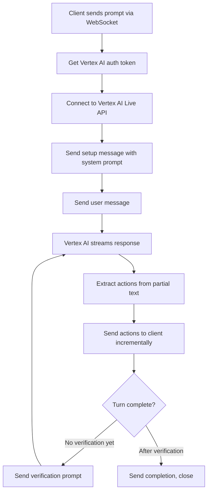
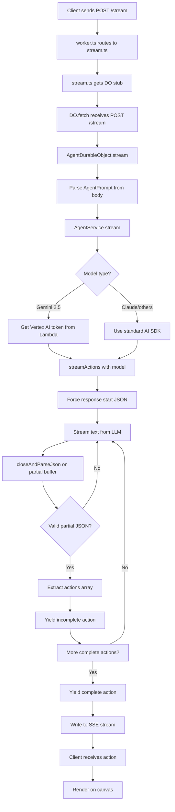
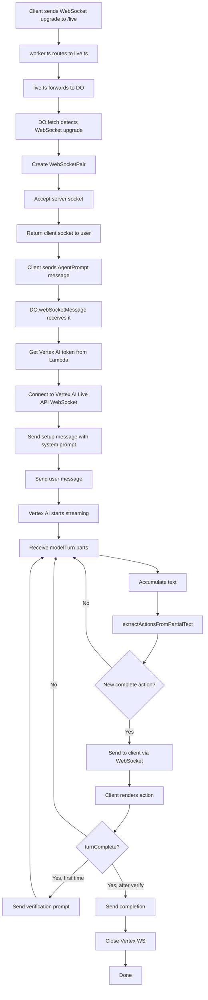

# 📊 Demo Worker Project Analysis

A comprehensive breakdown of the **demo/worker** architecture - an AI-powered whiteboard drawing agent built with **Cloudflare Workers**, **Durable Objects**, and **Google Gemini Live API**.

---

## 🏗️ **Architecture Overview**

This is a **real-time AI whiteboard agent** that listens to voice or text input and **draws diagrams** on a tldraw canvas. The architecture uses:

**User Input** → **WebSocket** → **Durable Object** → **Gemini Live API** → **Streaming Actions** → **Canvas Updates**

**Key Innovation**: This project uses **TWO connection modes**:
1. **REST Streaming** (`/stream`) - For text-based requests with models like Claude/Gemini
2. **WebSocket Live API** (`/live`) - For real-time voice input with Gemini Live 2.5 Flash

---

## 🤖 **AI Models Supported**

The project supports **multiple AI providers**:

### **Primary Models** (via `/stream`):
1. **Google Gemini 2.5 Flash** (Default) - `gemini-2.5-flash`
   - Requires Vertex AI authentication
   - Located in: [`models.ts:51-55`](file:///c:/Users/AJay/Desktop/aiboard/demo/worker/models.ts#L51-L55)

2. **Claude 4.5 Sonnet** (Recommended) - `claude-sonnet-4-5`
   - Via Anthropic API
   - Located in: [`models.ts:30-34`](file:///c:/Users/AJay/Desktop/aiboard/demo/worker/models.ts#L30-L34)

3. **Claude 4 Sonnet** / **Claude 3.5 Sonnet**
   - Alternative Anthropic models

### **Live API Model** (via `/live`):
- **Gemini Live 2.5 Flash** - WebSocket-based real-time model
- Supports voice input/output
- Located in: [`models.ts:58-62`](file:///c:/Users/AJay/Desktop/aiboard/demo/worker/models.ts#L58-L62)

---

## 📁 **File Structure & Key Components**

```
demo/worker/
├── worker.ts                    # 🌐 Main worker entry point
├── environment.ts               # 🔧 Environment types
├── models.ts                    # 🤖 Model definitions
├── routes/
│   ├── stream.ts               # 📨 REST streaming endpoint
│   └── live.ts                 # 🎙️ WebSocket live endpoint
├── do/
│   ├── AgentDurableObject.ts   # 🧠 Main agent logic (Durable Object)
│   ├── AgentService.ts         # 🛠️ AI service wrapper
│   └── closeAndParseJson.ts    # 🔧 JSON parser for partial streams
└── prompt/
    ├── buildSystemPrompt.ts    # 📝 System prompt builder
    ├── buildMessages.ts        # 💬 Message formatter
    ├── buildResponseSchema.ts  # 📋 Response schema
    └── getModelName.ts         # 🎯 Model selector
```

---

## 🔑 **Core Files Deep Dive**

### **1. `worker.ts` - Main Entry Point** (29 lines)

**Purpose**: Routes incoming requests to appropriate handlers

**Code Flow**:
```typescript
export default class extends WorkerEntrypoint<Environment> {
  override fetch(request: Request): Promise<Response> {
    return router.fetch(request, this.env, this.ctx)
  }
}

const router = AutoRouter()
  .post('/stream', stream)   // Text-based streaming
  .get('/live', live)         // WebSocket live API
```

**Exports**:
- Default class that extends `WorkerEntrypoint`
- `AgentDurableObject` - Makes DO available to Cloudflare

**CORS**: Enabled for all origins (`origin: '*'`)

---

### **2. `routes/stream.ts` - REST Streaming Endpoint** (26 lines)

**Purpose**: Handles text-based drawing requests with Server-Sent Events (SSE)

**Flow**:
```typescript
export async function stream(request: IRequest, env: Environment) {
  // 1. Get Durable Object
  const id = env.AGENT_DURABLE_OBJECT.idFromName('anonymous')
  const DO = env.AGENT_DURABLE_OBJECT.get(id)
  
  // 2. Forward request to DO
  const response = await DO.fetch(request.url, {
    method: 'POST',
    body: request.body
  })
  
  // 3. Return SSE stream
  return new Response(response.body, {
    headers: {
      'Content-Type': 'text/event-stream',
      'Cache-Control': 'no-cache, no-transform',
      // ... SSE headers
    }
  })
}
```

**What it does**:
- Creates/retrieves Durable Object with ID `'anonymous'`
- Forwards request body to DO's `/stream` endpoint
- Returns Server-Sent Events stream
- Used by models: Claude, Gemini (non-live)

---

### **3. `routes/live.ts` - WebSocket Live Endpoint** (23 lines)

**Purpose**: Handles WebSocket upgrade for Gemini Live API

**Flow**:
```typescript
export async function live(request: IRequest, env: Environment) {
  // Get DO stub
  const id = env.AGENT_DURABLE_OBJECT.idFromName('anonymous')
  const stub = env.AGENT_DURABLE_OBJECT.get(id)
  
  // Forward WebSocket upgrade to DO
  return stub.fetch(request.url, {
    method: request.method,
    headers: request.headers
  })
}
```

**What it does**:
- Detects WebSocket upgrade request
- Forwards to Durable Object
- DO handles the WebSocket connection
- Used only for: Gemini Live 2.5 Flash

---

### **4. `do/AgentDurableObject.ts` - Main Agent Logic** (449 lines)

This is the **heart of the system**. It's a Durable Object that manages state and AI interactions.

#### **Class Structure**:
```typescript
export class AgentDurableObject extends DurableObject<Environment> {
  service: AgentService              // AI service wrapper
  private activeSessions: Map        // Active WebSocket sessions
  private readonly router            // Request router
  
  // Methods:
  fetch()                  // Entry point for all requests
  stream()                 // SSE streaming (for /stream endpoint)
  webSocketMessage()       // WebSocket handler (for /live endpoint)
  webSocketClose()         // WebSocket cleanup
  webSocketError()         // WebSocket error handler
}
```

#### **Key Methods**:

##### **`fetch(request)` - Entry Point** (Lines 27-58)
```typescript
override fetch(request: Request): Response | Promise<Response> {
  const upgradeHeader = request.headers.get('Upgrade')
  
  if (upgradeHeader === 'websocket') {
    // Create WebSocket pair
    const pair = new WebSocketPair()
    const [client, server] = Object.values(pair)
    
    // Accept server-side WebSocket
    // This routes messages to webSocketMessage()
    this.ctx.acceptWebSocket(server)
    
    // Return client-side to user
    return new Response(null, {
      status: 101,
      webSocket: client
    })
  }
  
  // Route normal HTTP requests
  return this.router.fetch(request)
}
```

**What it does**:
- Checks if request is WebSocket upgrade
- If yes: Creates WebSocket pair, accepts server socket, returns client
- If no: Routes to `/stream` endpoint

---

##### **`stream(request)` - SSE Streaming** (Lines 66-110)
```typescript
private async stream(request: Request): Promise<Response> {
  const encoder = new TextEncoder()
  const { readable, writable } = new TransformStream()
  const writer = writable.getWriter()
  
  (async () => {
    const prompt = await request.json() as AgentPrompt
    
    // Stream actions from AI service
    for await (const change of this.service.stream(prompt)) {
      const data = `data: ${JSON.stringify(change)}\n\n`
      await writer.write(encoder.encode(data))
    }
    await writer.close()
  })()
  
  return new Response(readable, {
    headers: { 'Content-Type': 'text/event-stream', ... }
  })
}
```

**What it does**:
1. Parses `AgentPrompt` from request
2. Calls `AgentService.stream(prompt)`
3. Streams back `AgentAction` objects as SSE
4. Each action is a drawing command (create shape, update, delete, etc.)

**Used by**: Claude, Gemini (non-live) models

---

##### **`webSocketMessage(ws, message)` - Live API Handler** (Lines 115-303)

This is the **most complex method**. It handles real-time voice input via Gemini Live API.

**Flow**:


**Code breakdown**:

**Step 1: Get auth token** (Lines 123-124)
```typescript
const token = await this.getVertexAIToken()
// Calls AWS Lambda for Vertex AI access token
```

**Step 2: Build prompt** (Lines 127)
```typescript
const finalPrompt = this.getUserMessage(promptData)
// Extracts user messages from prompt data
```

**Step 3: Connect to Vertex AI** (Lines 130-133)
```typescript
const vertexWsUrl = `wss://us-central1-aiplatform.googleapis.com/ws/...?access_token=${token}`
const vertexWS = new WebSocket(vertexWsUrl)
```

**Step 4: Send setup** (Lines 140-158)
```typescript
vertexWS.addEventListener('open', () => {
  const setupMessage = {
    setup: {
      model: 'gemini-2.0-flash-live-preview-04-09',
      generationConfig: { responseModalities: ['TEXT'] },
      systemInstruction: {
        parts: [{ text: this.getSystemPrompt(promptData) }]
      }
    }
  }
  vertexWS.send(JSON.stringify(setupMessage))
```

**Step 5: Send user message** (Lines 161-173)
```typescript
  const userMessage = {
    clientContent: {
      turns: [{
        role: 'user',
        parts: [{ text: finalPrompt }]
      }],
      turnComplete: true
    }
  }
  vertexWS.send(JSON.stringify(userMessage))
})
```

**Step 6: Process AI responses** (Lines 176-277)
```typescript
vertexWS.addEventListener('message', (event) => {
  const aiResponse = JSON.parse(event.data)
  
  // Accumulate text from streaming parts
  if (aiResponse.serverContent?.modelTurn?.parts) {
    for (const part of aiResponse.serverContent.modelTurn.parts) {
      if (part.text) {
        accumulatedText += part.text
        
        // Extract actions incrementally
        const actions = this.extractActionsFromPartialText(accumulatedText)
        if (actions.length > sentActionCount) {
          const newActions = actions.slice(sentActionCount)
          for (const action of newActions) {
            // Send to client
            ws.send(JSON.stringify({
              type: 'action',
              action: { ...action, complete: true }
            }))
          }
          sentActionCount = actions.length
        }
      }
    }
  }
  
  // When turn is complete
  if (aiResponse.serverContent?.turnComplete) {
    if (!hasVerified) {
      // Send verification prompt
      const verifyMessage = {
        clientContent: {
          turns: [{
            role: 'user',
            parts: [{ text: "Review your drawing. Is it correct?" }]
          }],
          turnComplete: true
        }
      }
      vertexWS.send(JSON.stringify(verifyMessage))
      hasVerified = true
    } else {
      // Done - close
      ws.send(JSON.stringify({ type: 'complete' }))
      vertexWS.close()
    }
  }
})
```

**Key Innovation**: **Incremental Action Extraction**
- AI streams JSON text progressively
- `extractActionsFromPartialText()` parses incomplete JSON
- Sends actions to client as soon as they're complete
- This gives real-time drawing feedback!

---

**Step 7: Parse partial JSON** (Lines 380-428)
```typescript
private extractActionsFromPartialText(text: string): any[] {
  // Remove markdown code fences
  let clean = text.replace(/```json\s*/g, '').replace(/```\s*/g, '')
  
  // Find array start
  const arrayStart = clean.indexOf('[')
  if (arrayStart === -1) return []
  
  // Parse objects with depth tracking
  let depth = 0
  let start = -1
  
  for (let i = arrayStart + 1; i < clean.length; i++) {
    if (char === '{') {
      if (depth === 0) start = i
      depth++
    } else if (char === '}') {
      depth--
      if (depth === 0 && start !== -1) {
        // Found complete object
        const jsonStr = clean.substring(start, i + 1)
        const action = JSON.parse(jsonStr)
        if (action._type) {
          actions.push(action)
        }
      }
    }
  }
  return actions
}
```

**Why needed**: Gemini Live streams text character by character. We need to extract actions before the full JSON is complete!

---

### **5. `do/AgentService.ts` - AI Service Wrapper** (216 lines)

**Purpose**: Abstracts different AI providers (OpenAI, Anthropic, Google)

**Class Structure**:
```typescript
export class AgentService {
  openai: OpenAIProvider
  anthropic: AnthropicProvider
  google: GoogleGenerativeAIProvider
  
  constructor(env: Environment) {
    this.openai = createOpenAI({ apiKey: env.OPENAI_API_KEY })
    this.anthropic = createAnthropic({ apiKey: env.ANTHROPIC_API_KEY })
    this.google = createGoogleGenerativeAI({ apiKey: env.GOOGLE_API_KEY })
  }
  
  getModel(modelName): LanguageModel
  async *stream(prompt): AsyncGenerator<Streaming<AgentAction>>
}
```

**Key Method: `stream(prompt)`** (Lines 62-92)
```typescript
async *stream(prompt: AgentPrompt): AsyncGenerator<Streaming<AgentAction>> {
  const modelName = getModelName(prompt)
  let model = this.getModel(modelName)
  
  // Special handling for Gemini 2.5 Flash (Vertex AI)
  if (modelName === 'gemini-2.5-flash') {
    const token = await getAuthToken()  // Get from AWS Lambda
    const google = createGoogleGenerativeAI({
      baseURL: `https://aiplatform.googleapis.com/v1beta1/projects/${PROJECT_ID}/...`,
      headers: { Authorization: `Bearer ${token}` },
      apiKey: 'no-key'
    })
    model = google('gemini-2.5-flash')
  }
  
  // Stream actions
  for await (const event of streamActions(model, prompt)) {
    yield event
  }
}
```

**Why special Gemini handling**: Google Gemini 2.5 Flash uses Vertex AI, which requires:
1. OAuth2 token from AWS Lambda
2. Custom baseURL with project ID
3. Bearer token authentication

---

**Key Function: `streamActions()`** (Lines 95-215)

This handles the **actual streaming** from the AI model.

**Flow**:
```typescript
async function* streamActions(model, prompt) {
  // 1. Build messages and system prompt
  const messages = buildMessages(prompt)
  const systemPrompt = buildSystemPrompt(prompt)
  
  // 2. Force response start (for better JSON)
  if (model.provider === 'anthropic' || model.provider === 'google') {
    messages.push({
      role: 'assistant',
      content: '{"actions": [{"_type":'
    })
  }
  
  // 3. Stream from model
  const { textStream } = streamText({
    model,
    system: systemPrompt,
    messages,
    maxOutputTokens: 8192,
    temperature: 0
  })
  
  // 4. Parse streaming JSON into actions
  let buffer = '{"actions": [{"_type":'
  let cursor = 0
  let maybeIncompleteAction = null
  
  for await (const text of textStream) {
    buffer += text
    
    // Try to parse partial JSON
    const partialObject = closeAndParseJson(buffer)
    if (!partialObject) continue
    
    const actions = partialObject.actions
    if (!Array.isArray(actions)) continue
    
    // If we have a new complete action
    if (actions.length > cursor) {
      const action = actions[cursor - 1]
      yield { ...action, complete: true, time: ... }
      cursor++
    }
    
    // Yield incomplete current action
    const action = actions[cursor - 1]
    if (action) {
      yield { ...action, complete: false, time: ... }
    }
  }
  
  // Complete final action
  if (maybeIncompleteAction) {
    yield { ...maybeIncompleteAction, complete: true }
  }
}
```

**Key Pattern**: **Streaming with Completeness Tracking**
- Yields each action twice: First as `complete: false`, then `complete: true`
- Client can show progress (drawing in progress vs final)
- Uses `closeAndParseJson()` to parse incomplete JSON

---

### **6. `do/closeAndParseJson.ts` - Partial JSON Parser** (73 lines)

**Purpose**: Parse incomplete JSON strings by auto-closing brackets

**Magic Algorithm**:
```typescript
export function closeAndParseJson(string: string) {
  const stackOfOpenings = []
  
  // Track all opening/closing brackets
  for (let i = 0; i < string.length; i++) {
    const char = string[i]
    
    if (char === '"') {
      // Handle quotes (skip escaped ones)
      if (stackOfOpenings.at(-1) === '"') {
        stackOfOpenings.pop()
      } else {
        stackOfOpenings.push('"')
      }
    }
    
    if (char === '{' || char === '[') {
      stackOfOpenings.push(char)
    }
    
    if (char === '}' && stackOfOpenings.at(-1) === '{') {
      stackOfOpenings.pop()
    }
    
    if (char === ']' && stackOfOpenings.at(-1) === '[') {
     stackOfOpenings.pop()
    }
  }
  
  // Close all unclosed brackets
  for (let i = stackOfOpenings.length - 1; i >= 0; i--) {
    if (stackOfOpenings[i] === '{') string += '}'
    if (stackOfOpenings[i] === '[') string += ']'
    if (stackOfOpenings[i] === '"') string += '"'
  }
  
  // Try parsing
  try {
    return JSON.parse(string)
  } catch {
    return null
  }
}
```

**Example**:
```javascript
Input:  '{"actions": [{"_type": "create_shape", "shape": {"x": 100, "y":'

After closing: '{"actions": [{"_type": "create_shape", "shape": {"x": 100, "y": 0}}]}'

Result: Parses successfully!
```

**Why critical**: Without this, we'd have to wait for complete JSON before rendering. This enables **real-time progressive rendering**!

---

### **7. `models.ts` - Model Definitions** (93 lines)

**Purpose**: Centralized model configuration

**Structure**:
```typescript
export type AgentModelProvider = 'openai' | 'anthropic' | 'google' | 'google-live'

export const AGENT_MODEL_DEFINITIONS = {
  'claude-4.5-sonnet': {
    name: 'claude-4.5-sonnet',
    id: 'claude-sonnet-4-5',
    provider: 'anthropic'
  },
  'gemini-2.5-flash': {
    name: 'gemini-2.5-flash',
    id: 'gemini-2.5-flash',
    provider: 'google'
  },
  'gemini-live-2.5-flash': {
    name: 'gemini-live-2.5-flash',
    id: 'gemini-live-2.5-flash-preview',
    provider: 'google-live'  // WebSocket only!
  }
}
```

**Key Function**:
```typescript
export function getAgentModelDefinition(modelName: AgentModelName) {
  const definition = AGENT_MODEL_DEFINITIONS[modelName]
  if (!definition) throw new Error(`Model ${modelName} not found`)
  return definition
}
```

---

### **8. `shared/AgentHelpers.ts` - Coordinate Transformations** (511 lines)

**Purpose**: Handles all coordinate math and shape transformations

**Key Concepts**:

#### **Offset System**
The AI works in a **local coordinate system** relative to the "chat origin":
```typescript
constructor(agent: TldrawAgent) {
  const origin = agent.$chatOrigin.get()
  this.offset = {
    x: -origin.x,
    y: -origin.y
  }
}
```

**Why**: Keeps numbers small for the AI. Instead of saying "draw at x=1523, y=2847", we say "draw at x=10, y=20 relative to the conversation area".

#### **Key Methods**:

**Coordinate Transformations**:
```typescript
applyOffsetToShape(shape: SimpleShape): SimpleShape {
  if ('x1' in shape) {
    return {
      ...shape,
      x1: shape.x1 + this.offset.x,
      y1: shape.y1 + this.offset.y,
      x2: shape.x2 + this.offset.x,
      y2: shape.y2 + this.offset.y
    }
  }
  // ...
}

removeOffsetFromShape(shape: SimpleShape): SimpleShape {
  // Reverse operation
}
```

**Rounding with Memory**:
```typescript
roundAndSaveNumber(number: number, key: string): number {
  const rounded = Math.round(number)
  const diff = rounded - number
  this.roundingDiffMap.set(key, diff)  // Save for later!
  return rounded
}

unroundAndRestoreNumber(number: number, key: string): number {
  const diff = this.roundingDiffMap.get(key)
  return number + diff  // Restore original
}
```

**Why save diffs**: Prevents jitter when updating shapes. If a shape was at x=100.3, we round to 100 for the AI, but remember "+0.3" so when the AI moves it slightly, we preserve the original precision.

**Shape ID Management**:
```typescript
ensureShapeIdIsUnique(id: string): string {
  let newId = id
  let existingShape = editor.getShape(`shape:${newId}`)
  
  while (existingShape) {
    // Increment number at end: circle-1 -> circle-2 -> circle-3
    newId = newId.replace(/(\d+)$/, (m) => (+m + 1).toString())
    existingShape = editor.getShape(`shape:${newId}`)
  }
  
  // Track the transformation
  if (id !== newId) {
    this.shapeIdMap.set(id, newId)
  }
  
  return newId
}
```

**Why**: AI might say "create shape with id=circle". If "circle" exists, we rename to "circle-1". We track this so future AI references to "circle" use "circle-1".

---

## 🔄 **Complete Flow Diagrams**

### **Flow 1: REST Streaming (`/stream` endpoint)**



---

### **Flow 2: WebSocket Live API (`/live` endpoint)**



---

## ⚙️ **How Files Link Together**

### **Import Chain**:

```
worker.ts (Entry)
  ├── imports: routes/stream
  │     └── forwards to: AgentDurableObject
  ├── imports: routes/live
  │     └── forwards to: AgentDurableObject
  └── exports: AgentDurableObject

AgentDurableObject
  ├── imports: AgentService
  │     ├── imports: models (model definitions)
  │     ├── imports: prompt/buildMessages
  │     ├── imports: prompt/buildSystemPrompt
  │     ├── imports: prompt/getModelName
  │     └── imports: closeAndParseJson
  └── imports: prompt/buildSystemPrompt

AgentService
  ├── imports: @ai-sdk/anthropic (Claude)
  ├── imports: @ai-sdk/google (Gemini)
  ├── imports: @ai-sdk/openai (GPT)
  └── imports: ai (streamText from Vercel AI SDK)

Frontend (not shown, but connects via):
  ├── WebSocket → /live
  │     └── uses: AgentHelpers for coordinate transforms
  └── POST → /stream
        └── uses: AgentHelpers for coordinate transforms
```

---

## 🎯 **Complete User Flow Example**

### **Scenario**: User says "Draw a flowchart for login process"

**Using Live API (`/live`)**:

1. **Client**: Opens WebSocket to `/live`
2. **worker.ts**: Routes to `live.ts`
3. **live.ts**: Forwards to Durable Object
4. **DO.fetch()**: Detects WebSocket, creates pair, accepts server socket
5. **Client**: Sends message: `{messages: {messages: ["Draw a flowchart for login process"]}}`
6. **DO.webSocketMessage()**: 
   - Gets Vertex AI token from AWS Lambda
   - Connects to `wss://us-central1-aiplatform.googleapis.com/ws/...`
   - Sends setup with system prompt (whiteboard drawing instructions)
   - Sends user message
7. **Vertex AI**: Streams response
   ```
   "Here's a flowchart:\n```json\n[\n  {\"_type\": \"create_shape\", \"shape\": {\"shapeId\": \"start\", ..."
   ```
8. **DO**: Accumulates text, extracts actions incrementally
9. **DO**: Sends to client as soon as each action is complete:
   ```json
   {"type": "action", "action": {"_type": "create_shape", "shape": {...}, "complete": true}}
   ```
10. **Client**: Renders shape on canvas immediately
11. **Repeat** steps 7-10 for each shape (user box, login box, success box, arrows)
12. **Vertex AI**: Signals `turnComplete: true`
13. **DO**: Sends verification prompt: "Review your drawing. Is it correct?"
14. **Vertex AI**: Reviews, possibly adds missing shapes
15. **Vertex AI**: Signals `turnComplete: true` again
16. **DO**: Sends `{"type": "complete"}`, closes Vertex WS
17. **Done**: User sees complete flowchart!

---

## 💡 **Key Design Patterns**

### **1. Dual Connection Strategy**
- **REST SSE** for text-based models (Claude, Gemini)
- **WebSocket** for real-time voice/live models (Gemini Live)

### **2. Incremental JSON Parsing**
- `closeAndParseJson()` parses incomplete JSON
- `extractActionsFromPartialText()` extracts complete objects from arrays
- Enables **progressive rendering** before full response

### **3. Streaming with Completion States**
- Each action yielded twice: `complete: false` → `complete: true`
- Client can show "drawing in progress" vs "final"

### **4. Coordinate Offset System**
- AI works in local coordinates relative to chat origin
- Keeps numbers small and manageable
- `AgentHelpers` handles all transformations

### **5. Rounding with Memory**
- Round coordinates for AI (simpler numbers)
- Save diffs to restore precision
- Prevents jitter when updating shapes

### **6. Shape ID Uniqueness**
- Auto-increment IDs when collisions occur
- Track mappings so AI can reference by original ID

### **7. Two-Phase Drawing**
1. **Drawing phase**: AI creates all shapes
2. **Verification phase**: AI reviews and fixes errors

### **8. External Auth via Lambda**
- Vertex AI tokens fetched from AWS Lambda
- Keeps credentials secure
- Handles token refresh

---

## 🆚 **Comparison with Other Projects**

| Feature | demo/worker | agents-starter | talk2ai |
|---------|-------------|----------------|---------|
| **Interface** | Whiteboard drawing | Text chat with tools | Voice chat |
| **Connection** | WebSocket + SSE | WebSocket (agents framework) | WebSocket |
| **AI Provider** | Multi (Claude, Gemini) | OpenAI GPT-4 | Cloudflare AI (Llama) |
| **Key Feature** | Real-time diagram drawing | Tool confirmations | STT → LLM → TTS |
| **Streaming** | Partial JSON parsing | Standard | Sentence buffering |
| **State** | Durable Object (manual) | Agents framework (auto) | Durable Object (manual) |
| **Special Tech** | Gemini Live API, tldraw | Human-in-the-loop | Voice Activity Detection |
| **Complexity** | High (coordinate math) | Medium (tool framework) | Low (linear pipeline) |

---

## 🔧 **Technical Highlights**

### **Why Two Endpoints?**
- **`/stream`**: Works with any AI model that supports streaming text
- **`/live`**: Optimized for Gemini Live's WebSocket protocol

### **Why Vertex AI Auth via Lambda?**
- Google Cloud OAuth2 requires server-side flow
- Lambda provides token endpoint without exposing credentials
- Tokens cached and refreshed automatically

### **Why Partial JSON Parsing?**
- Standard `JSON.parse()` fails on incomplete strings
- `closeAndParseJson()` auto-completes brackets
- Enables showing drawing progress in real-time

### **Why Coordinate Offset?**
- AI struggles with large numbers (e.g., x=1523)
- Relative coordinates keep numbers small (x=10)
- Easier for AI to reason about spatial relationships

### **Why Verification Phase?**
- AI sometimes misses shapes or makes errors
- Second pass reviews and corrects mistakes
- Improves diagram accuracy significantly

---

## 📚 **Key Learnings**

1. **Durable Objects** provide stateful WebSocket handling on the edge
2. **Partial JSON parsing** enables real-time progressive rendering
3. **Coordinate transformations** make AI spatial reasoning easier
4. **Two-phase approaches** (draw + verify) improve quality
5. **Multi-provider architecture** allows swapping AI models
6. **WebSocket vs SSE** - use WebSocket for bidirectional, SSE for server→client streaming
7. **External auth services** keep credentials secure

---

## 🚀 **Architecture Summary**

```
┌─────────────┐
│   Client    │
│  (Browser)  │
└──────┬──────┘
       │
       ├─────────────┐
       │             │
  POST /stream   GET /live
       │             │
       ▼             ▼
┌─────────────────────────┐
│   Cloudflare Worker     │
│      (worker.ts)        │
└──────────┬──────────────┘
           │
           ▼
┌─────────────────────────┐
│   Durable Object (DO)   │
│ AgentDurableObject.ts   │
├─────────────────────────┤
│  stream()  │  webSocket │
│    SSE     │   Message  │
└──────┬─────┴─────┬──────┘
       │           │
       ▼           ▼
┌──────────────────────────┐
│     AgentService.ts      │
│  (AI Model Abstraction)  │
└──────────┬───────────────┘
           │
    ┌──────┴───────┬─────────┐
    ▼              ▼         ▼
[Anthropic]   [Google]  [OpenAI]
  Claude      Gemini      GPT
               │
               └─── Vertex AI (Gemini Live)
                     WebSocket
```

This is a **production-grade AI drawing agent** with real-time streaming, multi-provider support, and intelligent coordinate management! 🎨🚀
